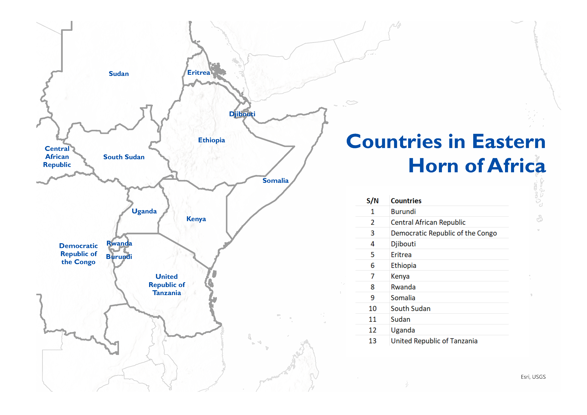

---
output:
  html_document:
    toc: yes
    theme: cerulean
    toc_float: yes
    keep_md: yes
    number_sections: true
    css: styles.css
---

<!--  -->

{ width=1000% height=100% }

# <strong>Technical Requirements and Resources</strong>

This section will guide you through the essential aspects of what you'll need in terms of hardware, software, and data resources to make the most of this hackathon experience. The goal is to ensure you have the tools and knowledge required to delve into the complex world of climate change and human mobility in the East and Horn of Africa region.

From hardware recommendations to software options and a detailed breakdown of available datasets, this guide is designed to assist both novice and experienced participants in navigating the technical landscape of our hackathon. Whether you're a coding enthusiast, a GIS specialist, or a data visualization wizard, we're hopeful you'll find valuable insights here to help you excel in this Hackathon.

## Hardware requirements

Participants are encouraged to bring their own laptops or devices for data analysis. It's recommended to have a device capable of running the chosen data analysis software.

## Recommended software

IOM Is partnering with **Snowflake**, a cloud-based data warehousing platform designed to store and analyze large volumes of data. It was developed to address the challenges of traditional data warehouses by offering a fully managed, scalable, and highly flexible solution for handling structured and semi-structured data.

Snowflake will be housing the data and there would be an opportunity to use the platform for data wrangling, analysis and visualization(Streamlit).

Additionally, we will integrate Google Colab's collaborative features to enable real-time collaboration and improve teamwork. Moreover, you have the flexibility to select software tools and programming languages that best align with your expertise and research objectives. Your options encompass Python, R, as well as specialized GIS software such as ArcGIS or QGIS, ensuring that your choice aligns seamlessly with the unique requirements of your research project.

If you prefer using Integrated Development Environments (IDEs) like Visual Studio or PyCharm, you are welcome to do so. However, please note that while we support your choice, we may not be able to provide technical support on version compatibility for these IDEs.

# <strong>Resources and Links</strong>

1. Tutorials and resources on Google Colab:
   - [Practical Introduction to Google Colab for Data Science](https://www.youtube.com/watch?v=oCngVVBSsmA&list=PLtqF5YXg7GLlAkFCnMedsu_RzW47kR0Nc)
   - [How to use R and Python in the same notebook on Google Colab](https://www.youtube.com/watch?v=Ri1MfaSlSW0&t=195s)
   - [Using R in Google Colab](https://www.youtube.com/watch?v=39F0M8MAL4E&t=3s)

2. Data Preparation and Visualization Resources:
   - Data Cleaning with Pandas (Python): [Link 1](https://realpython.com/python-data-cleaning-numpy-pandas/), [Link 2](https://www.youtube.com/watch?v=bDhvCp3_lYw)
   - Data Visualization with Python: [Link](https://d.docs.live.net/b884e7613e5498d8/02_JOBS/IOM/4_OTHERS/Hackthon_v2/7 Python Data Visualization Libraries in 15 minutes)
   - Data Visualization with ggplot2 (R): [Link](https://www.youtube.com/watch?v=HPJn1CMvtmI)
   - How to Visualize data in maps Using Geopandas [Links](https://www.analyticsvidhya.com/blog/2021/09/how-to-visualise-data-in-maps-using-geopandas/)
   - Working with Geospatial Data in R: [Link](https://jsta.github.io/glatos-spatial_workshop_materials/03-vector-csv-to-shapefile-in-r/index.html)
   - Data Viz Gallery with scripts: [Link](https://dataviz.unhcr.org/chart_gallery/)
   

# <strong>Data for hackathon</strong>

Participants will have access to Displacement Tracking Matrix (DTM) dataset related to the East and Horn of Africa region. These datasets will include information on displacement, climate-related factors, population movements, and more. Here is a list of the datasets you’ll have access to, all georeferenced to Admin 1 for the region of interest. The temporal dimension under consideration for the external data is 2000-2020. 

### Table of Data Sources

| Variable         | Description                                                       |Source                             |
|------------------|-------------------------------------------------------------------|-----------------------------------------------------|
| Socio-Economic   | Net migration (= total in-migration into area minus total out-migration from area) | [Source](https://zenodo.org/record/7997134)       |
| Socio-Economic   | Population count                                                  | [Source](https://zenodo.org/record/7997135)       |
| Socio-Economic   | GDP per capita                                                    | [Source](https://www.nature.com/articles/sdata20184) |
| Socio-Economic   | Human Development Index                                           | [Source](https://www.nature.com/articles/sdata20185) |
| Socio-Economic   | Proportion of females aged 0 to 19 (among total (= all sexes, all ages) population) | [Source](https://sedac.ciesin.columbia.edu/data/set/gpw-v4-basic-demographic-characteristics-rev11) |
| Socio-Economic   | Proportion of females aged 20 to 64                               | [Source](https://sedac.ciesin.columbia.edu/data/set/gpw-v4-basic-demographic-characteristics-rev12) |
| Socio-Economic   | Proportion of females aged 65 and above                           | [Source](https://sedac.ciesin.columbia.edu/data/set/gpw-v4-basic-demographic-characteristics-rev13) |
| Socio-Economic   | Proportion of males aged 0 to 19                                 | [Source](https://sedac.ciesin.columbia.edu/data/set/gpw-v4-basic-demographic-characteristics-rev14) |
| Socio-Economic   | Proportion of males aged 20 to 64                                | [Source](https://sedac.ciesin.columbia.edu/data/set/gpw-v4-basic-demographic-characteristics-rev15) |
| Socio-Economic   | Proportion of males aged 65 and above                            | [Source](https://sedac.ciesin.columbia.edu/data/set/gpw-v4-basic-demographic-characteristics-rev16) |
| Climate          | Mean temperature of the warmest month                            | [Source](https://crudata.uea.ac.uk/cru/data/hrg/cru_ts_4.05/) |
| Climate          | Mean temperature of the coldest month                            | [Source](https://crudata.uea.ac.uk/cru/data/hrg/cru_ts_4.05/) |
| Climate          | Mean annual temperature                                           | [Source](https://crudata.uea.ac.uk/cru/data/hrg/cru_ts_4.05/) |
| Climate          | Precipitation of the driest month                                | [Source](https://crudata.uea.ac.uk/cru/data/hrg/cru_ts_4.05/) |
| Climate          | Precipitation of the wettest month                               | [Source](https://crudata.uea.ac.uk/cru/data/hrg/cru_ts_4.05/) |
| Climate          | Annual precipitation                                              | [Source](https://crudata.uea.ac.uk/cru/data/hrg/cru_ts_4.05/) |
| Climate          | Annual number of wet days                                        | [Source](https://crudata.uea.ac.uk/cru/data/hrg/cru_ts_4.05/) |
| Climate          | Aridity (annual precipitation ÷ potential evapotranspiration)    | [Source](https://crudata.uea.ac.uk/cru/data/hrg/cru_ts_4.05/) |
| Food Security    | Mean annual food insecurity                                       | [Source](https://sedac.ciesin.columbia.edu/data/set/food-food-insecurity-hotspots) |
| Hazard           | Land fraction at risk of heatwave                                 | [Source](https://data.isimip.org/10.48364/ISIMIP.924045) |
| Hazard           | Land fraction at risk of wildfire                                 | [Source](https://data.isimip.org/10.48364/ISIMIP.924046) |
| Hazard           | Land fraction at risk of drought                                  | [Source](https://data.isimip.org/10.48364/ISIMIP.924047) |
| Hazard           | Land fraction at risk of river flood                              | [Source](https://data.isimip.org/10.48364/ISIMIP.924048) |
| Hazard           | Land fraction at risk of tropical cyclone                         | [Source](https://data.isimip.org/10.48364/ISIMIP.924049) |
| Hazard           | Land fraction at risk of crop failure                             | [Source](https://data.isimip.org/10.48364/ISIMIP.924050) |
| Land Use         | Land fraction covered by cropland                                 | [Source](https://essd.copernicus.org/articles/9/927/2017/essd-9-927-2017.html) |
| Land Use         | Land fraction covered by pasture                                  | [Source](https://essd.copernicus.org/articles/9/927/2017/essd-9-927-2017.html) |
| Land Use         | Land fraction covered by rangeland                                | [Source](https://essd.copernicus.org/articles/9/927/2017/essd-9-927-2017.html) |
| Land Use         | Land fraction covered by built-up land (cities, towns, …)         | [Source](https://essd.copernicus.org/articles/9/927/2017/essd-9-927-2017.html) |
| Migration        | Flow Monitoring Data: Flow monitoring aims to derive quantitative estimates of the flow of individuals through specific locations and to collect information about the profiles, intentions, and needs of the people moving. This component is well suited to quantifying highly mobile populations and providing a picture of complex mobility dynamics. | [Source](https://dtm.iom.int/datasets) |
| Displacement     | Mobility Tracking Data: Mobility tracking aims to quantify the presence of population categories of interest, reasons for displacement, length of displacement, and needs within defined geographical areas and locations, with a frequency that captures mobility dynamics | [Source](https://dtm.iom.int/datasets) |
| Conflicts        | Armed Conflict Location & Event Data Project (ACLED): The Armed Conflict Location & Event Data Project (ACLED) collects real-time data on the locations, dates, actors, fatalities, and types of all reported political violence and protest events around the world | [Source](https://acleddata.com/) |

### The use of own/external data?

While the primary focus will be on DTM datasets, participants are encouraged to supplement their research with other publicly available data sources if relevant to their research questions.

### Data format to expect?

The DTM datasets will be provided in standard data formats such as CSV and Excel each with its respective admin1 codes or names for easy mapping to shapefiles for geographic data. More information will be provided to participants on the event day.

### Countries in Eastern Horn of Africa.

{ width=500% height=100% }

### What is Admin Level?

- The concept of "admin_level" is used in geography and mapping to categorize and describe different levels of administrative divisions within a country or region. They mostly range from Admin 0 to Admin 10.

- Here's a simple breakdown:
  - Country Level (admin_level 0): At the top level, you have the entire country or region. For example, in the United States, this would be the entire country.
  - State or Province Level (admin_level 1): Inside the country, you have states or provinces. Think of these as slightly smaller boxes within big country box. For example, in the United States, you might have states like California or New York.
  - County or District Level (admin_level 2): Within states or provinces, you have counties or districts. These are even smaller boxes, like subdivisions within the states. In California, you could have counties like Los Angeles or San Francisco.

- More resources: [Admin Level on OpenStreetMap](https://wiki.openstreetmap.org/wiki/Key:admin_level)

# <strong>Internet Access</strong>

Will there be internet access available during the hackathon for data retrieval or online research?

- Yes, participants will have access to the internet to retrieve additional data, conduct research, and access online resources as needed for their projects.

# <strong>Technical Experts</strong>

Will there be technical experts available to assist with technical challenges or data-related questions?

- Yes, there will be technical experts on hand to provide guidance, answer technical questions, and assist participants with any challenges related to data analysis and software usage.

# <strong>Data Privacy and Ethics</strong>

Will there be any data privacy or ethical considerations when working with sensitive data?

- Participants will be expected to adhere to ethical guidelines and data privacy regulations when working with sensitive data. Organizers will provide guidance on these considerations.

# <strong>References and Publications</strong>

1.	Wood, T. (2022). The role of free movement agreements in addressing climate mobility. Forced Migration Review, (69).
2.	Castillejo, C. (2019). The influence of EU migration policy on regional free movement in the IGAD and ECOWAS regions (No. 11/2019). Discussion paper.
3.	Maru, M. T. (2021). Migration policy-making in Africa: determinants and implications for cooperation with Europe. Robert Schuman Centre for Advanced Studies Research Paper, (2021/54).
4.	Black, R. (2004). Migration and pro-poor policy in Africa.
5.	Afifi, T., Govil, R., Sakdapolrak, P., & Warner, K. (2012). Climate change, vulnerability and human mobility: Perspectives of refugees from the East and Horn of Africa. Bonn: United Nations University, Institute for Environment and Human Security (UNU-EHS).
6.	Hoffmann, R. (2022). Contextualizing climate change impacts on human mobility in African drylands.
7.	Zickgraf, C. (2019). Climate change and migration crisis in Africa. The Oxford handbook of migration crises, 347.
8.	Thalheimer, L., Williams, D. S., Van der Geest, K., & Otto, F. E. (2021). Advancing the evidence base of future warming impacts on human mobility in African drylands. Earth's Future, 9(10), e2020EF001958.
9.	Morrissey, J. (2013). Environmental change and human migration in Sub-Saharan Africa. In People on the move in a changing climate: the regional impact of environmental change on migration (pp. 81-109). Dordrecht: Springer Netherlands.
10.	Warner, K., & Afifi, T. (2014). Enhancing adaptation options and managing human mobility: the United Nations framework convention on climate change. Social research, 81(2), 299-326.
11.	Hastrup K, & Fog Olwig K. (2012). Climate Change and Human Mobility.
12.	Mueller, V., Sheriff, G., Dou, X., & Gray, C. (2020). Temporary migration and climate variation in eastern Africa.
13.	Li, Q., & Samimi, C. (2023). Assessing Human Mobility and Its Climatic and Socioeconomic Factors for Sustainable Development in Sub-Saharan Africa. Sustainability, 15(15), 11661.
14.	Martin, S. F., Bergmann, J., Rigaud, K. K., & Yameogo, N. D. (2020). Climate change, human mobility, and development.
15.	Ferris, E. (2020). Research on climate change and migration where are we and where are we going?
16.	Afifi, T., Milan, A., Etzold, B., Schraven, B., Rademacher-Schulz, C., Sakdapolrak, P., ... & Warner, K. (2016). Human mobility in response to rainfall variability: opportunities for migration as a successful adaptation strategy in eight case studies. Migration and Development, 5(2), 254-274.
17.	Kniveton, D. R., Smith, C. D., & Black, R. (2012). Emerging migration flows in a changing climate in dryland Africa.
18.	Warner, K. (2010). Global environmental change and migration: Governance challenges.
19.	Barnett, J., & McMichael, C. (2018). The effects of climate change on the geography and timing of human mobility.
20.	Tyson, P. D., Lee-Thorp, J., Holmgren, K., & Thackeray, J. F. (2002). Climatic Change, 52(01-Feb), 129-135.
21.	Marchiori, L., Maystadt, J. F., & Schumacher, I. (2012). The impact of weather anomalies on migration in sub-Saharan Africa. Journal of Environmental Economics and Management, 63(3), 355-374.
22.	Meze-Hausken, E. (2000). Mitigation and Adaptation Strategies for Global Change, 5(4), 379-406.
23.	Warner, K., Hamza, M., Oliver-Smith, A., Renaud, F., & Julca, A. (2010). Climate change, environmental degradation and migration. Natural Hazards, 55, 689-715.
24.	Nielsen, J. Ø., & Reenberg, A. (2010). Cultural barriers to climate change adaptation: A case study from Northern Burkina Faso. Global Environmental Change, 20(1), 142-152.
25.	Scheffran, J., Marmer, E., & Sow, P. (2012). Migration as a contribution to resilience and innovation in climate adaptation: Social networks and co-development in Northwest Africa. Applied geography, 33, 119-127.
26.	Gunvor Jónsson. (n.d.). The environmental factor in migration dynamics: A review of African case studies.
27.	Climate and Mobility in the West African Sahel: Conceptualising the Local Dimensions of the Environment and Migration Nexus
28.	Magadza, CH. (2000). Environmental Monitoring and Assessment, 61(1), 193-205.
29.	Twinomuhangi, R., Sseviiri, H., & Kato, AM. (2023). Contextualising environmental and climate change migration in Uganda.
30.	Dom'inguez-Mujica, J. (2016). Global Change and Human Mobility.
31.	Mpandeli, S., Nhamo, L., Hlahla, S., Naidoo, D., Liphadzi, S., Modi, A. T., & Mabhaudhi, T. (2020). Migration under climate change in southern Africa: A nexus planning perspective. Sustainability, 12(11), 4722.
32.	De Bruijn, M., & Van Dijk, H. (2003). Changing population mobility in West Africa: Fulbe pastoralists in central and south Mali. African affairs, 102(407), 285-307.
33.	Gioli, G., Hugo, G., Costa Mia, Scheffran, J. (2015). Human mobility, climate adaptation, and development.
34.	Mengiste, T. A. (2019). Precarious mobility: Infrastructures of Eritrean migration through the Sudan and the Sahara desert. African Human Mobility Review, 5(1).
35.	D. M. Bruijn, V. Dijk, D. Foeken. (n.d.). Mobile Africa: Changing patterns of movement in Africa and beyond.
36.	D. M. Bruijn, V. Dijk, D. Foeken. (n.d.). Mobile Africa: Changing patterns of movement in Africa and beyond.

As we embark on this journey together, let's remember that innovation, collaboration, and the pursuit of knowledge are the driving forces behind transformative change. We look forward to witnessing the impactful solutions and insights that emerge from your dedicated efforts during this hackathon.

Thank you for joining us in this important mission, and we wish you every success in your research and collaboration endeavors.

