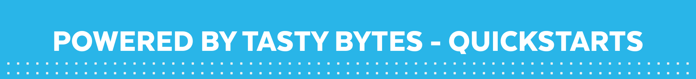

---
output:
  html_document:
    toc: yes
    theme: cerulean
    toc_float: yes
    keep_md: yes
    number_sections: true
    css: styles.css
---

<hr>
{ width=1000% height=100% }
This is section will give you a quick introduction to snowflake, connecting to the platform via Python and R. 


{ width=1000% height=100% }

# <span class="emph"><strong> What is Snowflake?</strong></span>
**Snowflake** is a cloud-based data warehousing platform designed to store and analyze large volumes of data. It was developed to address the challenges of traditional data warehouses by offering a fully managed, scalable, and highly flexible solution for handling structured and semi-structured data. 
[check this quick intro](https://www.youtube.com/watch?v=9PBvVeCQi0w)
- 
# <span class="emph"><strong> Zero to Snowflake: Tasty Bytes Quickstarts</strong></span>
<hr>

1. [Introduction to Snowflake Video](https://www.youtube.com/watch?v=9PBvVeCQi0w): An 8-minute introductory video on Snowflake to gain an idea of what it can do and see it in action.

2. [Introduction to Snowflake via Tasty Bytes](https://quickstarts.snowflake.com/guide/tasty_bytes_introduction/index.html#3): A quick walkthrough covering the majority of the basic topics relevant to the hackathon.

3. [Introduction to Snowpark](https://www.youtube.com/watch?v=ZzfCsmKoVQY): An introductory video on Snowpark.

# <span class="emph"><strong> Connecting to SnowFlake</strong></span>
In addition to working directly within the Snowflake environment, you also have the option to connect to Snowflake from various integrated development environments (IDEs), including RStudio. This section explores the different options available for connecting to Snowflake using RStudio.

**Please note that we will provide scripts to assist you in connecting to Snowflake via Python or Rstudio in case you encounter difficulties.** It is crucial to ensure that all necessary installations are completed, especially if you require administrative privileges. This includes setting up the ODBC driver for RStudio.

## Connecting from Python:
1. VS Code
2. Google Colab: 
3. HEX [2-minute video](https://www.youtube.com/watch?v=XiXdF2IlGRA) 

## Connecting from R studio:

1. **Install Prerequisites:** Ensure you have R and RStudio installed on your computer.

2. **Download ODBC Driver:** Download the Snowflake ODBC driver from this location:
  [Snowflake ODBC Driver](https://developers.snowflake.com/odbc/)

3. **Configure ODBC:** 

- For Windows Users: Follow the configuration instructions for ODBC on Windows using this link:
  [Snowflake ODBC Configuration for Windows](https://docs.snowflake.com/developer-guide/odbc/odbc-windows)

- For Mac Users:  Follow the configuration instructions for ODBC on Mac using this link:
  [Snowflake ODBC Configuration for Mac](https://docs.snowflake.com/developer-guide/odbc/odbc-mac)


4 **Sample Code**

- Use the following sample R code to connect to Snowflake:

```{r, echo=TRUE, eval=FALSE, class.source='mycode'}
# Load the required libraries
library(DBI)
library(odbc)

# Set up Snowflake connection parameters
dsn_name <- "YourSnowflakeDSN"
uid <- "YourUsername"
pwd <- "YourPassword"

# Connect to Snowflake
con <- DBI::dbConnect(odbc::odbc(),
                      Driver = 'SnowflakeDSIIDriver',
                      Server = 'XXXXXXX.REGION.azure.snowflakecomputing.com',
                      UID = 'ENTER YOUR SNOWFLAKE LOGIN USERNAME',
                      PWD = 'ENTER YOUR SNOWFLAKE LOGIN PASSWORD',
                      Database = 'SNOWFLAKE_SAMPLE_DATA')

# Now you can use 'con' to interact with Snowflake

Make sure to replace "YourSnowflakeDSN", "YourUsername", and "YourPassword" with your specific Snowflake connection details.

```

<hr>

# <span class="emph"><strong> Additional Relevant Resources & Reading Material</strong></span>

For a successful hackathon submission, it's essential to leverage Snowflake's unique features and capabilities. Explore the following resources to prepare for the event:

1. [Getting Started with Snowflake: Zero to Snowflake](https://quickstarts.snowflake.com/guide/getting_started_with_snowflake/index.html#0)
   - This comprehensive walkthrough introduces the core concepts of the Snowflake platform, including the Snowflake Marketplace, where customers can access thousands of data listings.

2. [Tasty Bytes Snowpark 101 for Data Science](https://quickstarts.snowflake.com/guide/tasty_bytes_snowpark_101_for_data_science/index.html?index=..%2F..index&amp;0)
   - Building on the Tasty Bytes introduction, this guide demonstrates how to perform essential data engineering tasks directly within the Snowflake UI.

3. [Tasty Bytes 101 for Geospatial](https://quickstarts.snowflake.com/guide/tasty_bytes_zero_to_snowflake_geospatial/#0)
   - Also utilizing the Tasty Bytes introduction, this guide showcases Snowflake's capability to work seamlessly with Geospatial data.

4. [Getting Started with Snowpark for Python and Streamlit](https://quickstarts.snowflake.com/guide/getting_started_with_snowpark_for_python_streamlit/index.html?index=..%2F..index&amp;0)
   - This standalone guide provides instructions for creating a Streamlit application using Snowpark for Python and data from Snowflake.

5. [Getting Started with Geospatial](https://quickstarts.snowflake.com/guide/getting_started_with_geospatial_geography/index.html?index=..%2F..index&amp;0)
   - This guide expands on the introduction to working with Geospatial data. It covers geospatial formats supported by Snowflake and offers walkthroughs with various functions on sample geospatial datasets.

# <span class="emph"><strong> Browsing and Installing Datasets via the Snowflake Marketplace
</strong></span>

## Step 1: Browsing Marketplace Datasets

1. Before or during the Hackathon, you can browse the Marketplace datasets through the [public search interface](https://app.snowflake.com/marketplace/) (no login required).

2. Filter the datasets to find those that are tagged as 'Free' or 'Free to try.'

3. Further narrow down datasets by selecting a specific geographic region. Use the 'Geo' filter and choose 'Specific Countries or States' from the options. Then, use the checkboxes to select a country or state.

4. Utilize other filters to focus on specific domains such as economy, energy, geospatial, or more.

## Step 2: Example Datasets

Here are some example datasets you can explore from the Snowflake Marketplace:

1. [Open CelliD - Open Database of Cell Towers](https://app.snowflake.com/marketplace/listing/GZSVZ8ON6J/dataconsulting-pl-opencellid-open-database-of-cell-towers)
   - Description: Global cell tower locations, serving as a proxy for urban population.

2. [Knoema Economy Data Atlas](https://app.snowflake.com/marketplace/listing/GZSTZ491VXQ/knoema-economy-data-atlas?search=knoema)
   - Description: Provides economic and financial developments and macroeconomic indicators that shape market trends.

3. [Knoema Demographics Data Atlas](https://app.snowflake.com/marketplace/listing/GZSTZ491VXM/knoema-demographics-data-atlas?search=knoema)
   - Description: Offers a wide variety of population dynamics indicators for most of the world's countries, including population size and growth, age dependency ratios, median age, birth and death rates, fertility rates, life expectancy at birth, migration, population density, and more.

4. [Knoema Daily Weather Data](https://app.snowflake.com/marketplace/listing/GZSTZV57YNYD/knoema-daily-weather-data?search=knoema)
   - Description: Contains daily climatic data for the world, including daily mean temperature, pressure, precipitation, vapor pressure, and sunshine data from over 9,000 stations.

Feel free to explore these datasets to find valuable information for your Hackathon project.


<hr>